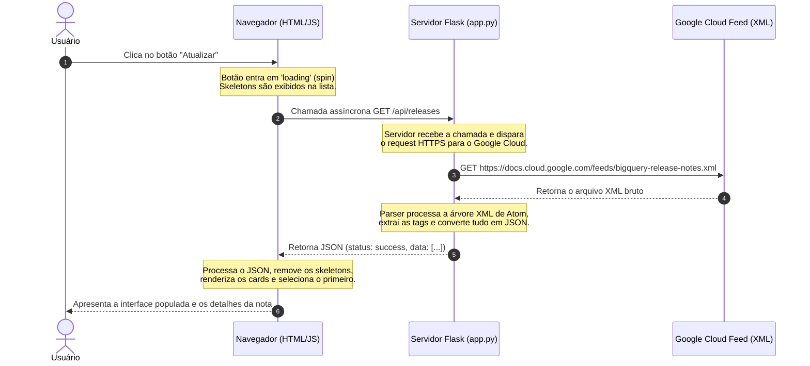

# 📊 BigQuery Release Notes Tracker

> Um aplicativo web elegante e moderno para acompanhar, filtrar e compartilhar as últimas notas de versão do **Google BigQuery** em tempo real.

Este projeto foi construído usando **Python + Flask** no backend e uma interface rica com **HTML5, CSS3 (Vanilla) e JavaScript puros** no frontend, consumindo diretamente o feed XML oficial do Google Cloud.

---

## 🛠️ Tecnologias Utilizadas

*   **Backend:** [Python](https://www.python.org/) e [Flask](https://flask.palletsprojects.com/) (para criar o servidor e a API).
*   **Parsing:** Biblioteca nativa `xml.etree.ElementTree` do Python (processamento leve e rápido de XML).
*   **Frontend:**
    *   **HTML5:** Estrutura semântica e acessível (SEO otimizado).
    *   **Vanilla CSS:** Estilo personalizado com tema escuro imersivo, efeitos de glassmorphism e animações fluidas.
    *   **Vanilla JavaScript:** Consumo assíncrono da API, renderização de cards em tempo real, filtros de pesquisa e compartilhamento direto no X (Twitter).
    *   **Fontes e Ícones:** Google Fonts (Plus Jakarta Sans & Inter) e FontAwesome.

---

## 📂 Estrutura do Projeto

```text
agy-cli-projects/
├── .venv/                 # Ambiente virtual do Python (ignorado pelo Git)
├── static/
│   ├── app.js             # Lógica do frontend (requisições, busca e compartilhamento)
│   └── style.css          # Design visual, tema escuro e responsividade
├── templates/
│   └── index.html         # Página única da aplicação
├── .gitignore             # Arquivos ignorados pelo Git
├── app.py                 # Arquivo principal do servidor Flask
├── README.md              # Documentação do projeto
└── requirements.txt       # Dependências do Python
```

---

## 🔄 Ciclo de Vida da Requisição (Fluxo Request-Response)

Aqui está uma representação gráfica de como os dados trafegam pela aplicação quando uma atualização é solicitada:



---

## 🚀 Como Executar o Projeto Localmente

### 1. Clonar ou Acessar a Pasta do Projeto
Certifique-se de que está no diretório correto:
```bash
cd C:\Users\lucas\Documents\Antigravity\agy-cli-projects
```

### 2. Configurar o Ambiente Virtual (`.venv`)
O ambiente virtual isola as dependências do projeto para evitar conflitos na sua máquina.

*   **Criar o ambiente virtual** (se já não estiver criado):
    ```bash
    python -m venv .venv
    ```
*   **Ativar o ambiente virtual:**
    *   No **PowerShell** (Windows):
        ```powershell
        .venv\Scripts\Activate.ps1
        ```
    *   No **Prompt de Comando (CMD)**:
        ```cmd
        .venv\Scripts\activate.bat
        ```
    *   No **Linux/macOS**:
        ```bash
        source .venv/bin/activate
        ```

*(Você saberá que o ambiente está ativo quando o nome `(.venv)` aparecer no início da linha de comando).*

### 3. Instalar as Dependências
Com o ambiente virtual ativo, instale o Flask:
```bash
pip install flask
```

*(Opcional) Gerar o arquivo de dependências:*
```bash
pip freeze > requirements.txt
```

### 4. Iniciar o Servidor
Execute o arquivo do servidor:
```bash
python app.py
```

### 5. Acessar o Aplicativo
Abra seu navegador e acesse:
👉 **[http://127.0.0.1:5000](http://127.0.0.1:5000)**

---

## 💡 Recursos & Funcionalidades

1.  **Sincronização Direta:** O botão **Atualizar** faz uma requisição em tempo real para o feed oficial da Google e atualiza a interface instantaneamente.
2.  **Visualizador com Skeleton Loading:** Transição suave com carregamento simulado enquanto os dados são obtidos da API.
3.  **Filtro Inteligente:** Digite palavras-chave no campo de busca para pesquisar no título, na categoria ou no conteúdo dos lançamentos.
4.  **Extração de Categorias:** A aplicação analisa o conteúdo XML e categoriza automaticamente as notas em tags visuais como `Feature`, `Announcement`, `Change`, `Issue` ou `Breaking`.
5.  **Compartilhe no X (Twitter):** Selecione uma atualização, clique em "Compartilhar no X" e publique instantaneamente um tweet contendo o resumo e o link oficial da documentação.

---

## 🌟 Mensagem do Antigravity

Parabéns por dar este passo e desvendar novas tecnologias! Aprender a estruturar uma aplicação web completa (integrando backend em Python com APIs e frontends assíncronos) é um marco excelente para qualquer profissional de tecnologia. 

A arquitetura utilizada aqui (Backend Servindo API + Frontend desacoplado) é exatamente a base dos sistemas modernos de escala global. Continue explorando, modificando os estilos no `style.css` e inserindo novas ideias. O céu é o limite para a sua carreira! 🚀
